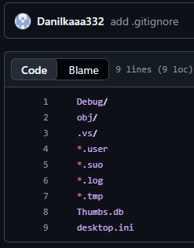
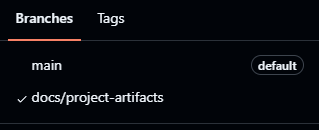
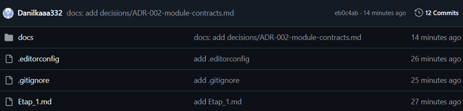
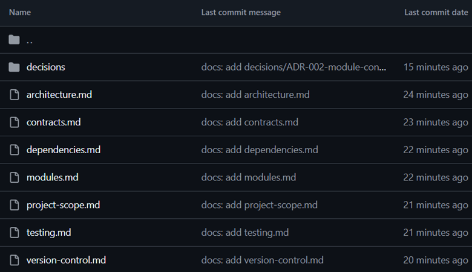
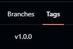
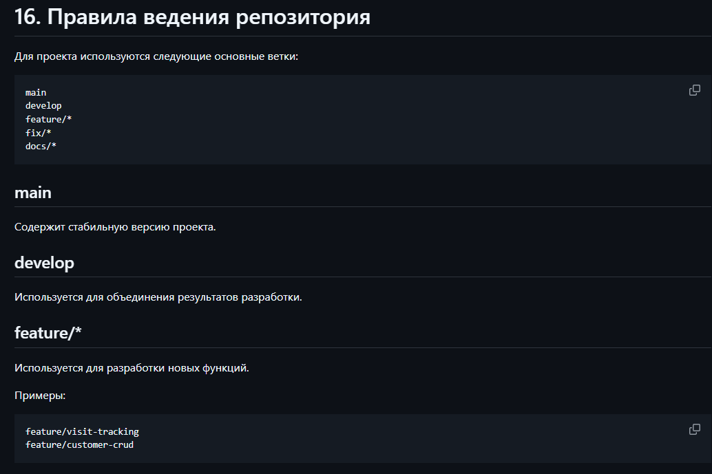
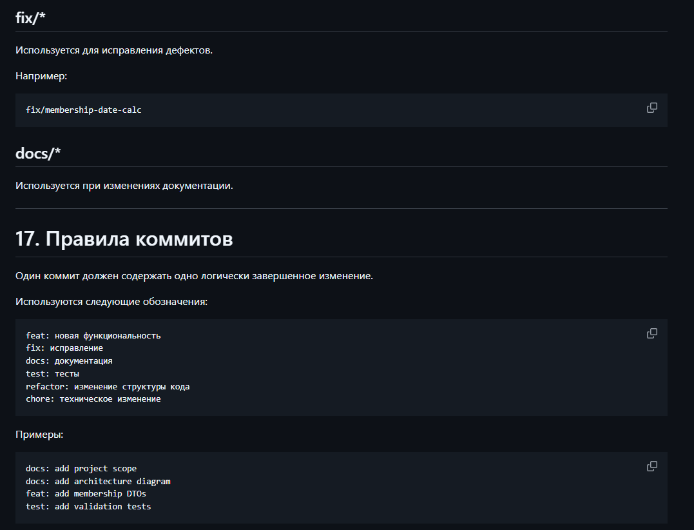
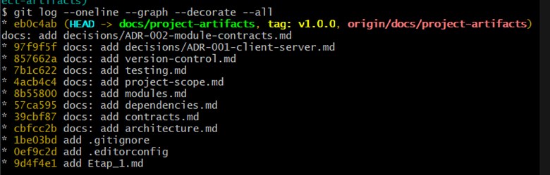

# Курсовое проектирование. Этап 2. Настройка работы системы контроля версий: типы импортируемых файлов, пути, фильтры и параметры импорта в репозиторий

**МДК:** 02.02 «Инструментальные средства разработки программного обеспечения»  
**Продолжительность:** 4 часа  
**Основной стек:** C# / .NET 9, Git  
**Форма:** этап курсового проектирования

## 1. Цель

Получить проверяемый результат по теме «Настройка работы системы контроля версий: типы импортируемых файлов, пути, фильтры и параметры импорта в репозиторий», связанный с собственным курсовым проектом студента, и оформить его в репозитории так, чтобы решение можно было воспроизвести и проверить.

## 2. Предварительные условия

- тема курсового проекта согласована с преподавателем;
- создан репозиторий проекта;
- установлен .NET SDK 9 и Git;
- структура проекта соответствует его фактическим задачам;
- студент фиксирует исходное состояние репозитория перед началом этапа.

## 3. Задание

## 3.1 добавить `.gitignore` для .NET:

---

## 3.2 убедиться, что `bin`, `obj`, локальные настройки IDE, временные файлы и секреты не отслеживаются:

---

## 3.3 добавить `.editorconfig`:

---

## 3.4 создать рабочую ветку:

---

## 3.5 выполнить не менее пяти осмысленных коммитов:

---

## 3.6 создать учебный тег контрольного состояния:

---

## 3.7 описать правила ветвления, коммитов и слияния в `docs/version-control.md`:

---

## 3.8 получить граф истории командой:

---

## 7. Контрольные вопросы

1. Какой конкретный результат этапа можно независимо проверить?
2. Какие артефакты были созданы или обновлены?
3. Какими командами или тестами подтвержден результат?
4. Какие интеграционные риски уменьшены?
5. Какие изменения в будущем потребуют обновления артефактов этого этапа?
6. Как по истории Git определить выполненные действия?
7. Какие ошибки были найдены при самопроверке?
8. Что необходимо другому разработчику для повторения результата?

## 8. Вывод

Этап считается завершенным, когда результат существует не только в коде или словах автора, но и подтверждается репозиторием, документацией и проверками.
